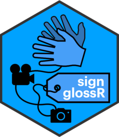

# signglossR 

**v3.0.0**

<!-- badges: start -->
<!-- badges: end -->

An R package that facilitates *visual* representation of sign language data

Download using:
```
devtools::install_github("borstell/signglossR")
```

# News
In April/May 2025, the `{signglossR}` package was completely re-written 
to achieve the following goals:

- **Minimize** the number of individual functions to avoid clutter
- **Reduce** the number of dependencies (now cut in half)
- **Vectorize** code to allow for multiple inputs across functions
- **Avoid** external command calls and focus on R-internal functions/packages
- **Focus** package to image/video functionality (thus removing Openpose functions)

`{signglossR}` v3 uses R's native pipe (`|>`) and placeholder (`_`) 
and thus requires R >= 4.2.0.


# Paper
The `signglossR` package is described in the 
LREC sign language workshop proceedings paper 
found here: <https://aclanthology.org/2022.signlang-1.3/>.

See also [Licence](#license) for suggested citation.


# Introduction
The R package `signglossR` includes various R functions (created, adapted, and imported) 
that may help sign language researchers work with a visual representation of sign language data 
(i.e. videos and images). Hopefully, overcoming some of the technical obstacles will encourage 
more researchers to adopt **\#GlossGesang** and avoid \#TyrannyOfGlossing (see [Glossing](#glossing)). 

The intention of this package is to collect many different existing resources 
and adapt them to sign language researchers. The hard work in actual coding has 
been done by others: `signglossR` relies heavily on other R packages such as 
[`av`](https://docs.ropensci.org/av/), [`{magick}`](https://docs.ropensci.org/magick) 
and [`opencv`](https://docs.ropensci.org/opencv). While heavily reduced in v3.0.0, 
there is still an option to use [`ffmpeg`](https://ffmpeg.org) in one function 
as this is faster than R-internal video processing.


## Glossing
Glossing has been a standard way of representing sign language data in linguistics research. 
In practice, this has meant using written word labels in place of signs, such as in this example 
from the [STS Dictionary](https://teckensprakslexikon.su.se/ord/01913#exempel2):

](https://teckensprakslexikon.su.se/movies/01/kott-01913-fras-2.mp4){width="50%"}

    _____headshake
    IX EAT MEAT IX
    'They don't eat meat'
    (Svenskt teckenspråkslexikon 2020, example 01913-2)

This is problematic since [sign languages](#languages) are visual languages, 
and any written representation of the signs comes with an incredible loss of information: 

- _Which signs are used if there are **variants** for the same concept?_ 
- _How are signs moving in **space**?_
- _What **non-manual** markers are present alongside the manual signs?_

Many sign language researchers are in favor of the concept of \#GlossGesang, 
named after Julie Hochgesang (a proponent of visual glossing and opponent of 
the [Tyranny of glossing](https://doi.org/10.6084/m9.figshare.9941807.v1)). 
\#GlossGesang has been tentatively defined as:

* *"Always present sign language data in a visual format (videos/images) without relying solely on glossing."* (Börstell 2019 on then *Twitter*)


# Functionality

## Accessing language resources

As in previous versions of `{signglossR}`, two lexical databases can be accessed:

- [ASL Signbank](http://aslsignbank.com)
- [STS Dictionary](https://teckensprakslexikon.su.se)

In functions that interact with these databases, the default setting is STS and
the `lang` argument has to be set to `"ASL"` to access ASL Signbank.

> [!NOTE]
> In <3.0.0 versions of `{signglossR}`, the `lang` argument was called `acronym`.


### Sign IDs and glosses

Two functions are available for finding sign IDs or ID glosses of signs.

**Note** that these functions are mainly to help interact with media files
(images/videos) of the lexical databases, rather than for using as written-only 
representations of signs. We *want* visual representations of sign language data!

#### `gloss2id()`
This function takes one or more ID glosses as its input and returns the sign 
entry's corresponding ID **number** (if found):
```
> gloss2id("DEAFix", lang = "ASL")
[1] "103"
```

Case is irrelevant:
```
> gloss2id("deafix", lang = "asl")
[1] "103"
```

For STS, this search is not done on unique ID glosses, but rather keywords in 
the dictionary database. Therefore some searches may return multiple IDs 
(separated by "|"):

```
> gloss2id("dotter")
[1] "00111|01943"
```

New in v3.0.0 is that you can more easily input multiple glosses:

```
> gloss2id(c("häxa", "troll"))
[1] "03264|08036" "03265" 
```

> [!NOTE]
> Errors may occur when glosses with no associated IDs


#### `id2gloss()`
This function takes an ID number as its input and returns the sign entry's 
corresponding ID **gloss** (if found):
```
> id2gloss(1)
[1] "TAXI(J)"
```
Integer or string is irrelevant:
```
> id2gloss("103", lang = "asl")
[1] "DEAFix"
```

New in v3.0.0 is that you can more easily input multiple IDs:

```
> id2gloss(1:3)
[1] "TAXI(J)"  "DÖPA(ea)" "MÖSSA(J)"
```


### Images

Using the IDs for the language resources, we can access images of signs easily.

#### `get_image()`
This function inputs an  ID number and downloads the image of the corresponding 
sign entry in the selected language:
```
get_image(id = 10, lang = "sts")

```
](./man/figures/bjorn-00010.jpg)

In this image, the image of BJÖRN ('bear') from STS becomes very wide as there 
are several frames to represent the sign. We could try to use the `overlay` 
argument to create an overlay image instead:

```
get_image(id = 10, lang = "sts", overlay = TRUE)

```
](./man/figures/bjorn-00010-overlay.jpg)

This looks better in >=v3.0.0, since the overlay of >2 images now blends images
pairwise and combines the rest horizontally.

Another approach is to use the `trim` argument, which trims each frame to 
a factor (0 to 1) of its original width:
```
get_image(10, overlay = FALSE, trim = .8)

```
](./man/figures/bjorn-00010-trimmed.jpg)

> [!NOTE]
> The `overlay` and `trim` arguments are only available for STS as ASL Signbank has pre-composed images.

You can also input multiple IDs to download all at once:
```
get_image(c(1, 2, 4, 7))

```

### Videos

With the IDs, we can also access videos of signs.

#### `get_video()`
This function inputs an  ID number and downloads the video of the corresponding 
sign entry in the selected language.
```
get_video(1)

```
](./man/figures/taxi-00001-tecken.mp4){width="50%"}

You can also input multiple IDs to download all at once:
```
get_video(c(1, 2, 4, 7))

```

### GIFs

For STS, we can also access GIFs of signs.

#### `get_gif()`
This function inputs an  ID number and downloads the GIF of the corresponding 
sign entry.
```
get_gif(123)

```
](./man/figures/00123-animation.gif)


## Composing images and videos

### `censor_image()`
Maybe you need to censor part of your image for some reason. Perhaps to hide the 
identity of the signer. This can be done using the function `censor_image()` 
which allows you to either automatically blur the face (if detected) or 
completely cover some region of the image. 

If `automatic` is set to `FALSE` (default is `TRUE`), you will need to define a 
`geometry` region to cover with a rectangle. If set to `TRUE`, the imported 
function `opencv::ocv_facemask()` will automatically detect faces and use as a 
mask for blurring/censoring.

```
censor_image(file = "bjorn-00010.jpg", path = "/path/to/output/", filename = "bjorn-00010-censored.jpg")

```
](./man/figures/bjorn-00010-censored.jpg)

Through piping, we could also download and process images in a single run. 

```
get_image(1) |> 
  censor_image(path = "/path/to/output/", filename = "bjorn-00010-censored.jpg")
  
```

The automatic function is particularly useful when there are multiple faces to 
be censored in the same image, as multiple regions can be identified and masked 
at once. However, the method may fail if a face is (partially) covered.


Manual censoring can be useful as you can select any location to block out.
For example, maybe you need to censor a region (e.g., the hand) for an experiment:
```
get_image(1, trim = .7, overlay = T) |> 
  censor_image(
    image = "taxi-00001.jpg", 
    path = "/path/to/file/", 
    filename = "taxi-00001-censored-manually.jpg", 
    automatic = FALSE, 
    width = 130, height = 90, x = 120, y = 10)
    
```
](./man/figures/taxi-00001-censored-manually.jpg)

### `censor_video()`
New in v3.0.0 is that you can also censor videos automatically, just like images:
```
censor_video(
  video = "taxi-00001-tecken.mp4", 
  filename = "taxi-00001-tecken-censored.mp4")

```
](./man/figures/taxi-00001-tecken-censored.mp4){width="50%"}

Note that video censoring can be automatic, but the face masking is a rectangle.


### `combine_images()`
The function `combine_images()` lets you input multiple images and either 
combine them horizontally, stack them vertically (if `stack = TRUE`) or create 
a blended composite of them.
```
composite_image(c(img1, img2), filename = "composite-image.jpg")

```

This function is used internally by `get_sign()` for STS signs images that are
combined or blended together as a single output image.

### `compose_image()`
This function lets you trim, scale and annotate images. This is mainly a 
combination of multiple functions from the 
[`{magick}`](https://docs.ropensci.org/magick) package.

Here, I'm telling the function to scale the image to 70%, add a border and add 
a text annotation at a certain location and with some font specifications:
```
get_image(10, trim = .7, overlay = T) |> 
  compose_image(
    filename = "bjorn-00010-glossed.jpg", 
    scale = .7, 
    border = T, 
    text = "BJÖRN ('bear')", 
    boxcolor = "black", 
    gravity = "south", 
    location = "+0-5", 
    fontsize = 40, 
    font = "PT Sans")
    
```
](./man/figures/bjorn-00010-glossed.jpg)


### `compose_video()`
This function does many similar things to the equivalent image function above, 
but is adapted to video-relevant modifications. For instance, in the example 
below, I have specified wanting to scale the video to 70% size, add a repetition 
of the video at the end of the video that will be playing slower (by default) 
and adds a text annotation with font specifications throughout the frames.

```
get_video(10) |> 
  compose_video(filename = "bjorn-00010-glossed.mp4", 
                scale = .7, 
                rep = T, 
                text = "BJÖRN ('bear')", 
                fontsize = 40, 
                font = "PT Sans")
    
```
](./man/figures/bjorn-00010-glossed.mp4){width="50%"}

Note that modifying and annotating videos requires reading all frames to memory 
and then performing annotations by frame, so it can take some time and is 
discouraged for longer videos.


## ELAN functionality

### `read_elan()`
This function reads a single ELAN annotation file (`.eaf`) and outputs a 
data frame (specifically a `tibble`). This function is mainly relevant for 
other files manipulating images/videos from ELAN annotations as input. If you 
are looking for functions to read ELAN (`.eaf`) files more generally, I would 
rather refer you to my [`{tidysigns}`](https://github.com/borstell/tidysigns) package.

### `segment_elan_image()`
This function inputs an ELAN annotation file (`.eaf`) and a video file, and uses 
the segmentations (and annotations) for segmenting a combined image output.

It is possible to have the annotations themselves function as input for text 
annotations to be added. In the example below, I have a short video from the 
STS Corpus ([Svenskt teckenspråkskorpus (2025)](https://teckensprakskorpus.su.se/video/sslc01_041.eaf)) 
which has been segmented on the tier "segmentation_s1" and then the function 
uses this input along with the gloss tier(s) to output videos of all the signs 
that fall within that segment as a composite image. I noticed that there is a 
slight offset in the sync between the ELAN annotations and the video, so this is 
offset in the input (push images 5 frames forward). Text annotations are added 
to each sign frame.

```
segment_elan_image(eaf = "sslc01_041.eaf", 
                   video = "sslc01_041.mp4",
                   segmentation_tier = "segmentation_s1", 
                   gloss_tier = c("Glosa_DH S1", "Glosa_NonDH S1"), 
                   frame_offset = 5, 
                   path = "/path/to/output/", 
                   gloss_text = T, 
                   fontsize = 26, 
                   gravity = "northeast")
                   
```
](./man/figures/sslc01_041_00036960.jpg)


### `segment_elan_video()`
This function inputs an ELAN annotation file (`.eaf`) and a video file, and uses 
the annotations for segmenting the video into shorter video outputs.

Note that this function does not allow for text annotations etc. as this is a 
very slow process. Rather, the individual video outputs could be annotated with 
the `compose_video()` function further, as these videos would be shorter.

The function has two methods, specified with the `method` argument. Default is 
"av", which uses the `{av}` package. This is very slow, but works _within_ R. 
The other option is "ffmpeg", which instead calls [`ffmpeg`](https://ffmpeg.org) 
directly. The `ffmpeg` option is **much** faster (x10 times faster even with 
shorter videos), but requires a local install of `ffmpeg`.

In the example below, we use the `ffmpeg` method to segment a video associated 
with an ELAN file into shorter videos based on the segmentations on the tier 
"segmentation_s2". In addition, a 1000 millisecond padding is added, which means 
that the output videos start 1 second before and end 1 second after the end points
of the annotation segments.
```
segment_elan_video(eaf = "sslc01_041.eaf", 
                   segmentation_tier = "segmentation_s2",
                   video = "sslc01_041.mp4",
                   path = "/path/to/output/videos/", 
                   padding = 1000,
                   method = "ffmpeg")

```


## Miscellaneous

### `cite_source()`
Alongside the standard R `citation()` function for citing packages (or R itself), 
the function `cite_source()` outputs the preferred citation format of the 
package as well as the language resources accessed.
```
> cite_source()

To cite ASL Signbank in publications, please use:

  Julie A. Hochgesang, Onno Crasborn & Diane Lillo-Martin. 2025 ASL Signbank.
  New Haven, CT: Haskins Lab, Yale University.
  http://aslsignbank.com/

      (See also: http://aslsignbank.com/about/conditions/)

A BibTeX entry for LaTeX users is

@Manual{aslsignbank,
    title = {{ASL Signbank}},
    author = {Julie A. Hochgesang and Onno Crasborn and Diane Lillo-Martin},
    organization = {Haskins Lab, Yale University},
    address = {New Haven, CT},
    year = {2025},
    url = {http://aslsignbank.com}
  }

To cite the STS dictionary in publications, please use:

  Svenskt teckenspråkslexikon. 2025. Svenskt teckenspråkslexikon. Stockholm:
  Sign Language Section, Department of Linguistics, Stockholm University.
  https://teckensprakslexikon.ling.su.se

      (See also: https://teckensprakslexikon.ling.su.se/information)

A BibTeX entry for LaTeX users is

@Manual{tsplex,
    title = {Svenskt teckenspråkslexikon},
    author = {Svenskt teckenspråkslexikon},
    organization = {Sign Language Section, Department of Linguistics, Stockholm University},
    address = {Stockholm},
    year = {2025},
    url = {https://teckensprakslexikon.ling.su.se}
  }

[...]

```


## Deprecated functions

With `{signglossR}` v3.0.0, the limited Openpose functionality as well as now 
irrelevant helper functions have been removed. Additionally, the `make_gif()` 
function has been removed, as this functionality exists in the 
[`{magick}`](https://docs.ropensci.org/magick) package.


# Logo
The logo was rendered using the [`{hexSticker}`](https://github.com/GuangchuangYu/hexSticker) package.


# License
- This R package can be used, modified, and shared freely under the 
[CC BY-NC-SA 4.0 license](https://creativecommons.org/licenses/by-nc-sa/4.0/). 

- Please acknowledge any use of the `signglossR` package. 
The preferred citation is given by the `citation("signglossR")` function 
given below, alongside the accompanying 
[paper](https://aclanthology.org/2022.signlang-1.3/) also listed as `bibTeX` below. 

- Do cite the original sources when using any material downloaded by `signglossR`! 
The preferred citations for these can be found using the `signglossR` function 
`cite_source()`.

- The `{signglossR}` package relies heavily on the packages 
[`{magick}`](https://docs.ropensci.org/magick) and [`{av}`](https://docs.ropensci.org/av).
I recommend using these packages for further functionality and customizability.
Please cite these packages too, if using `signglossR` image/video functions!

```
citation("signglossR")

To cite reports in publications, please use:

  Börstell, Carl. 2022. Introducing the signglossR Package. In Eleni Efthimiou, Stavroula-Evita Fotinea, Thomas Hanke, Julie
  A. Hochgesang, Jette Kristoffersen, Johanna Mesch & Marc Schulder (eds.), Proceedings of the LREC2022 10th Workshop on the
  Representation and Processing of Sign Languages: Multilingual Sign Language Resources, 16–23. Marseille: European Language
  Resources Association (ELRA). https://aclanthology.org/2022.signlang-1.3/.

A BibTeX entry for LaTeX users is

@inproceedings{borstell-2022-introducing,
  author    = {B{\"o}rstell, Carl},
  title     = {Introducing the {signglossR} Package},
  pages     = {16--23},
  editor    = {Efthimiou, Eleni and Fotinea, Stavroula-Evita and Hanke, Thomas and Hochgesang, Julie A. and Kristoffersen, Jette and Mesch, Johanna and Schulder, Marc},
  booktitle = {Proceedings of the {LREC2022} 10th Workshop on the Representation and Processing of Sign Languages: Multilingual Sign Language Resources},
  maintitle = {13th International Conference on Language Resources and Evaluation ({LREC} 2022)},
  publisher = {{European Language Resources Association (ELRA)}},
  address   = {Marseille, France},
  day       = {25},
  month     = jun,
  year      = {2022},
  isbn      = {979-10-95546-86-3},
  language  = {english},
  url       = {https://aclanthology.org/2022.signlang-1.3/}
}
```


](https://mirrors.creativecommons.org/presskit/buttons/88x31/png/by-nc-sa.png)
